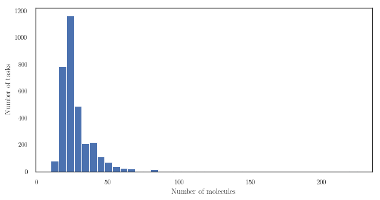

# The `antibacterial` collection

## A few statistics

|        Metric |       Value |
| -------------:| -----------:|
|       # tasks |       3 255 |
|   # molecules |      26 993 |
| cross-product |  87 862 215 |
|    # examples |      90 048 |
|       density |      0.10 % |

## Brief Description

This collection encompasses 3 255 tasks that report the minimum concentration needed to stop the development of a given strain of bacterium.

There are 26 993 individual molecules in total. The number of molecules whose binding force is available for a single protein ranges from 10 to 225.

The figure above shows the distribution of the number of examples for each task. On average, 28 molecules are reported for each bacterium.
