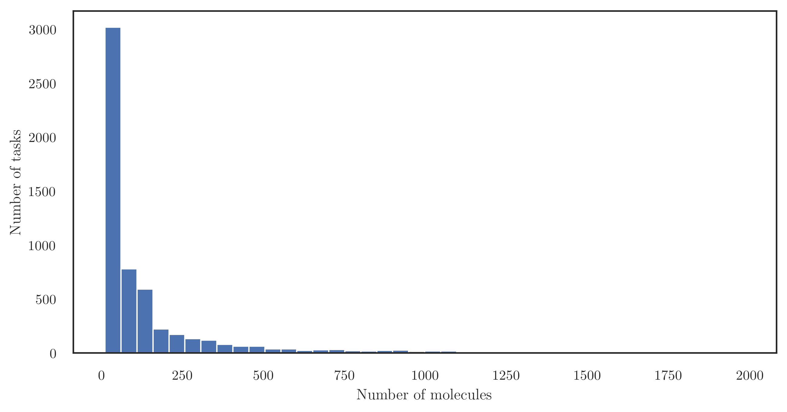

# The `binding` collection

## Brief Description

This collection encompasses 5 517 tasks that report the binding force between a set of molecules and a given protein.

There are 573 035 individual molecules in total. The number of molecules whose binding force is available for a single protein ranges from 10 to 8 886.

The figure above shows the distribution of the number of examples for each task. On average, 190 molecules are reported for each protein.
